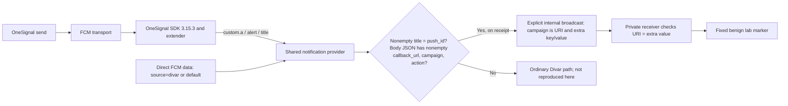

# Divar 11.14.20-b push-handler lab

**Hamid Kashfi · October 2026 · LLM-assisted lab documentation**

The [Divar code analysis](https://gist.github.com/raminfp/a548a2af86108eb40b8bffc5c8f07aaa) describes an inserted route from a specially formed push message to `ReportDeserializer`, a worker capable of fetching instructions and handling supplied bytes. In [my X post](https://x.com/hkashfi/status/2106147963332633025), I raised the possibility that the installed app could serve as a delivery path to selected phones. Whether any such message was sent, or any later stage ran on a phone, remains unverified.

This lab reconstructs the **observed inserted notification-handler branch** in the infected `11.14.20-b` APK. It is a small synthetic app, not a repackaged Divar APK. “Exact” here means the branch conditions, field mapping, internal Intent, receiver check, and **receipt-time trigger** follow that build’s code. The dangerous worker is replaced by a fixed, harmless marker; the ordinary Divar notification path is outside this focused lab. Source APK SHA-256: `cdaf0bf256269eec249787299b5ebb7058f3944c86b14debfa41f9c263ad17da`.

The `11.14.20-b` inserted branch runs while the push is processed; the user does not have to see or tap a notification.

## The observed route



The inserted provider branch sends the broadcast and **returns before the provider’s ordinary notification code**. The OneSignal extender then resumes its SDK processing and may display a notification, but the receiver has already started its worker. Neither the broadcast nor the worker depends on a tap. In the original APK, `campaign` is decoded by Base64 then XOR with `0x68` to form the worker’s fetch URL; `callback_url` is only a nonempty guard in this branch. The lab accepts only its fixed marker destination and never runs downloaded code.

The two entry routes reach the same provider in the sampled APK:

- **OneSignal:** the bundled parser takes provider data from `custom.a`, body from `alert`, and title from `title`.
- **Divar Firebase service:** for `source=divar` or `source=default`, it passes the FCM data map as provider data, with `body` and `title` from that map. Other `source` values follow different routes or stop.

This lab uses **real direct FCM cloud delivery** to a Google-enabled Android emulator. The [sample messages](docs/sample-events.md) show the FCM data and controls. No historical Divar push or provider log is included.

## OneSignal status

The preserved APK contains the SDK marker `onesignal/android/031503`. This lab embeds **stock** `com.onesignal:OneSignal:3.15.3` and a real `NotificationExtenderService`. The SDK normalizes `custom.a`, `alert`, and `title`; the extender passes those values into the same provider method as direct FCM, then returns control to OneSignal’s normal SDK processing. The sampled APK also contains a Divar-specific REST address in its OneSignal code, so matching the SDK version does **not** establish identical transport backends. The lab emulator has registered an active OneSignal push subscription, but **live OneSignal message delivery is not yet verified**.

## Run the lab

Use JDK 21, Android SDK platform 34, a Google-enabled emulator, ADB, Python 3, and `gcloud`. Android Studio can supply the SDK and emulator. The app has its own package and Firebase project; do not use Divar’s push credentials.

1. Create a [Firebase project and Android app](https://firebase.google.com/docs/android/setup) for the exact package `org.hamidk.divarpushlab`. Enable the **Firebase Cloud Messaging API (HTTP v1)** in its Google Cloud project. Download that app’s `google-services.json` to `app/google-services.json`; Git ignores it. This FCM setup needs no Android signing SHA fingerprint; do not use Divar’s Firebase configuration.
2. Start the fixed marker server: `python3 tools/marker_server.py`. It listens on host loopback `127.0.0.1:18765`; the emulator reaches it at `10.0.2.2` ([Android emulator networking](https://developer.android.com/studio/run/emulator-networking-address)).
3. Start the emulator, then build and install the app:

   ```sh
   ./gradlew :app:assembleDebug
   adb install -r app/build/outputs/apk/debug/app-debug.apk
   ```

4. Open the app and wait for its FCM registration token. The app masks it on screen and the helper reads it privately through ADB. The HTTP v1 request targets [`message.token`](https://firebase.google.com/docs/cloud-messaging/send/v1-api#send_messages_to_specific_devices), which also allows the legacy OneSignal 3.15.3 SDK to register in this single app.
5. In **your** project, give the sending identity `cloudmessaging.messages.create` (for example, the [Firebase Cloud Messaging Service Editor role](https://cloud.google.com/iam/docs/roles-permissions/firebasecloudmessaging)). For a personal test, sign in with `gcloud auth login`; for automation, use a dedicated service account with that role and [short-lived impersonated credentials](https://cloud.google.com/docs/authentication/use-service-account-impersonation). The helper reads the current `gcloud auth print-access-token` identity; it needs no downloaded service-account key.
6. Send one of the fixed [sample messages](docs/sample-events.md):

   ```sh
   python3 tools/send_cloud_sample.py --project YOUR_FIREBASE_PROJECT_ID accepted
   python3 tools/send_cloud_sample.py --project YOUR_FIREBASE_PROJECT_ID title-mismatch
   ```

7. Watch the app status, `adb logcat -d -s DivarPushLab:I '*:S'`, and the marker server. A matching cloud push should reach the provider, trigger the internal receiver, and complete the benign marker **without a tap**. Rejected samples should not reach the marker server. FCM API acceptance alone is not proof of device delivery.

The public checkout builds without `google-services.json`, but cloud registration and delivery require your own Firebase configuration. The fixed marker server has tests: `python3 -m unittest discover -s tools -p 'test_*.py'`.

## Test through OneSignal

This is a separate cloud route through the **actual 3.15.3 SDK**. It still uses FCM to reach the emulator.

As of 4 October 2026, [OneSignal's Free plan](https://onesignal.com/pricing) includes unlimited mobile push sends for up to 1,000 monthly active users.

1. In the **same Firebase project**, create a dedicated sender service account with only `cloudmessaging.messages.create` and `firebase.projects.get` (a custom IAM role). Generate a service-account JSON key. In the new OneSignal app, open **Settings → Push & In-App → Platforms → Google Android (FCM)** and upload that JSON key. [OneSignal documents the required permissions and upload path](https://documentation.onesignal.com/docs/android-firebase-credentials). Keep the key out of this repository.
2. In the ignored `app/onesignal.properties`, set `app_id=<YOUR_ONESIGNAL_APP_ID>` and `sender_id=<FIREBASE_PROJECT_NUMBER>` (the numeric Firebase sender ID). Stock OneSignal 3.15.3 requires the sender ID; its registration failed when the lab supplied only the sampled `REMOTE-<app_id>` manifest pattern. Rebuild, install, and open the app. Wait for an active OneSignal push subscription; a player ID alone does not establish that a push token was registered. The app masks identifiers on screen, and the helper reads the private debug-app subscription ID through ADB.
3. Supply your OneSignal App API key as the `ONESIGNAL_API_KEY` environment variable, then send the fixed vectors:

   ```sh
   python3 tools/send_onesignal_sample.py accepted
   python3 tools/send_onesignal_sample.py title-mismatch
   ```

   The helper obtains the App ID and player ID locally and accepts no target, URL, or receiver-class override. An API response is **not** device-delivery evidence; check the emulator status, logcat, marker-server request, and the provider’s delivery record. See [sample messages](docs/sample-events.md).

**After the test:** stop the marker server, uninstall the lab app or clear its data to discard registration IDs, and remove the ignored configuration files if retiring the project. Revoke the direct FCM sender role and the dedicated OneSignal service-account key, or delete the lab Firebase/OneSignal projects. Keep FCM tokens, player IDs, OAuth tokens, OneSignal API keys, and service-account JSON out of commits and screen recordings. `google-services.json` identifies a project but is not itself a sender credential.

## What is and is not reproduced

| Boundary | Lab treatment |
| --- | --- |
| Push parsing and trigger | Reconstructs the observed `11.14.20-b` OneSignal field mapping, FCM source route, shared provider checks, internal broadcast, and receiver equality check. |
| Timing | Matching message acts during push processing. The notification shade and user tap are not part of the inserted branch. |
| Worker | Replaced with a fixed marker on host loopback and a harmless in-app action. No server-selected method, arbitrary URL, executable file, or privilege escalation. |
| Transport | Direct FCM reaches this synthetic app. Stock OneSignal 3.15.3 is embedded, but the sampled APK appears to use a Divar-specific OneSignal REST endpoint. Live OneSignal delivery is pending verification. |

This is a behavioral reproduction of a **specific sampled handler branch**, not evidence that attackers sent a matching push. A separate vulnerability would be needed for a payload to cross Android’s app sandbox. Logs from affected phones, Divar’s sender infrastructure, Firebase, and potentially OneSignal could help reconstruct messages and downstream requests; the fields and retention available from each must be checked. A sender record by itself cannot prove execution on a device.

The [evidence notes](docs/evidence.md) identify the source methods and the remaining validation limits. The original APK and decompiled code are not distributed in this repository. License for this lab’s original material: [MIT](LICENSE). The bundled OneSignal SDK has its own [modified MIT terms and full notice](THIRD_PARTY_NOTICES.md).
