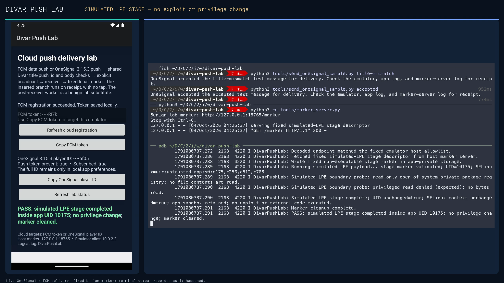
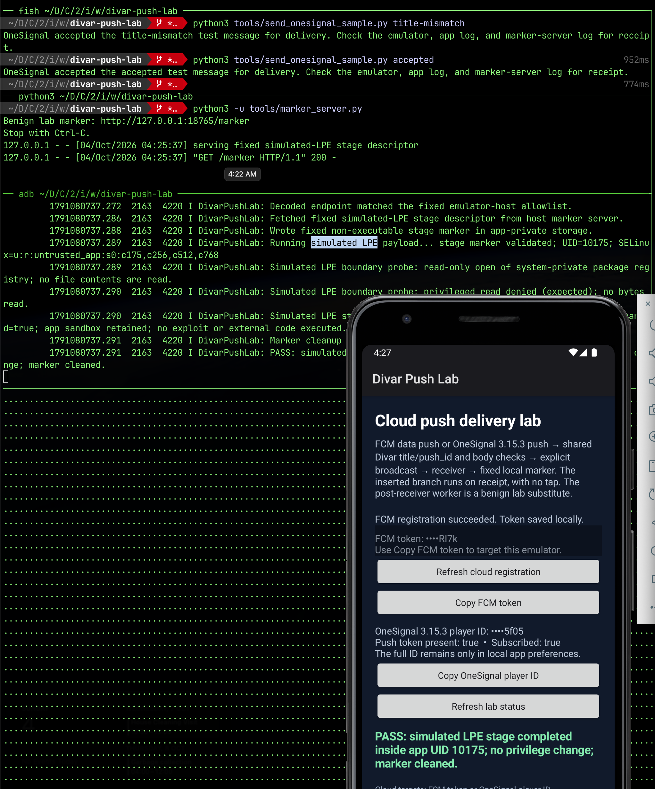
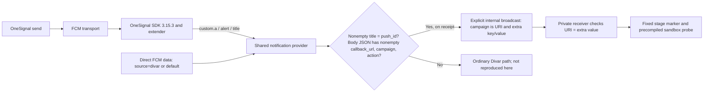

# Divar 11.14.20-b push-handler lab

**Hamid Kashfi · October 2026 · LLM-assisted lab documentation**

The [Divar code analysis](https://gist.github.com/raminfp/a548a2af86108eb40b8bffc5c8f07aaa) describes an inserted route from a specially formed push message to `ReportDeserializer`, a worker capable of fetching instructions and handling supplied bytes. In [my X post](https://x.com/hkashfi/status/2106147963332633025), I raised the possibility that the installed app could serve as a delivery path to selected phones. Whether any such message was sent, or any later stage ran on a phone, remains unverified.

This lab reconstructs the **observed inserted notification-handler branch** in the infected `11.14.20-b` APK. It is a small synthetic app, not a repackaged Divar APK. “Exact” here means the branch conditions, field mapping, internal Intent, receiver check, and **receipt-time trigger** follow that build’s code. The dangerous worker is replaced by a fixed simulated-LPE stage that cannot escalate privileges; the ordinary Divar notification path is outside this focused lab. Source APK SHA-256: `cdaf0bf256269eec249787299b5ebb7058f3944c86b14debfa41f9c263ad17da`.

The `11.14.20-b` code indicates that a well-formed matching push is **silent on the normal path**: it starts the worker on receipt, then records the push locally without posting an Android notification. No tap is needed. This conclusion comes from the preserved APK's code; this lab did not send a push to the original Divar app.

## Research report and IOC Hunt

- [Divar backdoor technical analysis v2.8 (PDF)](research/Divar_backdoor_technical_analysis.pdf) — 26-page CTI report covering signed APK chronology, push and HTTP entry routes, code evolution, CFGs, the lab evidence, and a bounded review of four other Iranian apps. Its opening assessment includes a sourced Bazaar install ranking; the cover discloses LLM generation.
- [گزارش فنی فارسی v2.8.1 (PDF)](research/Divar_backdoor_technical_analysis_fa.pdf) — the corrected 27-page Persian edition, with idiomatic code-execution terminology, translated flow diagrams, a linked 282-file inventory, the YARA appendix, sources, and the same evidence limits.
- [From push to position: Iranian mobile apps companion v2.1 (PDF)](research/Iran_mobile_apps_companion.pdf) — a 20-page signed-APK audit of Balad, Neshan, Snapp and Tapsi, with exact-file coverage, chronology, route graphs, semantic code changes, permissions, and evidence limits. Its future-work table covers ten selected Iranian apps and 217 observed version/build targets still needing an exact APK. No coordinated campaign or malicious collection is established. The [103-file audit inventory (CSV)](research/Iran_mobile_apps_sample_inventory_v2.0.csv), [ten-app version inventory](research/future_audit_top10/README.md), [technical evidence notes](research/evidence/mobile_apps/README.md) and [PDF builder](research/source/build_iran_mobile_apps_companion_v2.py) accompany it.
- [گزارش همراه فارسی، از پوش تا موقعیت مکانی v2.1 (PDF)](research/Iran_mobile_apps_companion_fa.pdf) — the 20-page Persian edition of the cross-app audit. It uses the English report's exact charts, timelines, diagrams, tables, and page layout with translated text. The [translation sources](research/source/) and [PDF builder](research/source/build_iran_mobile_apps_companion_fa.py) are included.

- [IOC Hunt package (ZIP)](research/IOC_Hunt_2026-10-04.zip) · [Browse the files](research/IOC_Hunt/README.md) — YARA rules, a DEX scanner, VT search guidance, 69 route-positive APK hashes, the 282-build reference inventory, and validation data. Hits are leads for code-flow review, not proof of payload delivery or execution.

Published report PDFs use stable filenames. Git history records earlier revisions; drafts are kept in the local DFIR workspace.

[SHA-256 checksums](research/SHA256SUMS) identify the exact reports, inventory and ZIP in this repository.

## Demo

[](docs/evidence/onesignal_cli_simulated_lpe_2026-10-04.mp4)

**[Watch the 40-second end-to-end video](docs/evidence/onesignal_cli_simulated_lpe_2026-10-04.mp4)** · [Read the device log](docs/evidence/onesignal_cli_simulated_lpe_2026-10-04.txt). The OneSignal CLI sends a control and a matching push; the matching push triggers one marker request and a **simulated** LPE stage on receipt. Android denies the read-only protected-file probe. No exploit runs and privileges do not change.

<a href="docs/media/live_terminal_emulator_2026-10-04.png"></a>

*Live terminal and emulator capture. [Open the full-size screenshot](docs/media/live_terminal_emulator_2026-10-04.png).*

## The observed route



The inserted provider branch sends the broadcast and **returns before the provider’s ordinary notification code**. The sampled OneSignal extender then calls `AbstractC3677v0.q(..., true)`, which stores the message locally with `opened=1`; it does **not** call the SDK's notification-posting routine `AbstractC3677v0.c(...)`. A separate received-event callback runs afterward. That local `opened` flag is not evidence of a user tap. The extender's exception fallback may display an alert, and a separately supplied FCM system-notification payload is a different route. The direct FCM **data** route reaches the same provider and likewise returns before Divar's ordinary notification code.

The synthetic lab uses `return true` after the cloned provider call to prevent stock OneSignal 3.15.3 from displaying the message. Stock display crashed on this API 33/target 34 setup because its `PendingIntent` lacked a required mutability flag. The lab therefore matches the silent outcome through a different internal SDK path; original-APK runtime display has not been tested. In the original APK, `campaign` is decoded by Base64 then XOR with `0x68` to form the worker’s fetch URL; `callback_url` is only a nonempty guard in this branch. The lab accepts only its fixed marker destination and never runs downloaded code. Its precompiled stage attempts a **read-only open** of Android's protected package registry, expects `EACCES` or `EPERM`, reads no bytes, and checks that UID and SELinux context did not change.

The two entry routes reach the same provider in the sampled APK:

- **OneSignal:** the bundled parser takes provider data from `custom.a`, body from `alert`, and title from `title`.
- **Divar Firebase service:** for `source=divar` or `source=default`, it passes the FCM data map as provider data, with `body` and `title` from that map. Other `source` values follow different routes or stop.

This lab uses **real cloud delivery** to a Google-enabled Android emulator: direct FCM for the Divar adapter and OneSignal envelope controls, and a separate live send through a new OneSignal test app. The [sample messages](docs/sample-events.md) describe both routes. No historical Divar push or provider log is included.

## OneSignal status

The preserved APK contains the SDK marker `onesignal/android/031503`. This lab embeds **stock** `com.onesignal:OneSignal:3.15.3` and a real `NotificationExtenderService`. A fixed OneSignal-shaped envelope sent **directly through FCM** reached the SDK parser, extender, shared provider, receiver, and benign marker [on receipt](docs/onesignal_envelope_receipt_log.txt). A [title-mismatch control](docs/onesignal_envelope_title_mismatch_log.txt) reached the extender without dispatching. Those earlier logs used an extender that returned `false`, allowing stock SDK display processing. The current extender returns `true` only after the cloned provider call, suppressing SDK display on this emulator.

On 4 October 2026, the new OneSignal test app also sent both controls through **OneSignal → FCM → emulator**. The title-mismatch push arrived at 01:50:59 UTC without dispatch or a marker request. The matching push arrived at 01:51:55.223 UTC; the cloned branch reached the receiver by .238 and completed the fixed benign marker by .334, without a tap. OneSignal's dashboard reported both test sends successful; device and marker-server observations establish the handler outcome. The sampled APK also contains a Divar-specific REST address in its OneSignal code, so this test does **not** establish that the original Divar backend sent or handled any such message.

The newer OneSignal API CLI run tested the simulated-LPE stage end to end on 4 October ([40-second video](docs/evidence/onesignal_cli_simulated_lpe_2026-10-04.mp4); [device log](docs/evidence/onesignal_cli_simulated_lpe_2026-10-04.txt)). At 02:25:20.173 UTC, the title-mismatch control reached the extender and stopped without dispatch or a marker request. At 02:25:37.252 UTC, the matching push reached the extender; the receiver ran on receipt, the marker server handled one `GET /marker`, and the fixed stage reported a denied read-only open of Android's protected package registry. The app logged `PASS` by .291, with UID `10175` and its SELinux context unchanged. This was a sandbox-denial demonstration, not an exploit.

## Run the lab

Use JDK 21, Android SDK platform 34, a Google-enabled emulator, ADB, Python 3, and `gcloud`. Android Studio can supply the SDK and emulator. The app has its own package and Firebase project; do not use Divar’s push credentials.

1. Create a [Firebase project and Android app](https://firebase.google.com/docs/android/setup) for the exact package `org.hamidk.divarpushlab`. Enable the **Firebase Cloud Messaging API (HTTP v1)** in its Google Cloud project. Download that app’s `google-services.json` to `app/google-services.json`; Git ignores it. This FCM setup needs no Android signing SHA fingerprint; do not use Divar’s Firebase configuration.
2. Start the fixed marker server: `python3 tools/marker_server.py`. It listens on host loopback `127.0.0.1:18765`; the emulator reaches it at `10.0.2.2` ([Android emulator networking](https://developer.android.com/studio/run/emulator-networking-address)).
3. Start the emulator, then build and install the app:

   ```sh
   ./gradlew :app:assembleDebug
   adb install -r app/build/outputs/apk/debug/app-debug.apk
   ```

4. Open the app and wait for its FCM registration token. The app masks it on screen and the helper reads it privately through ADB. The HTTP v1 request targets [`message.token`](https://firebase.google.com/docs/cloud-messaging/send/v1-api#send_messages_to_specific_devices), which also allows the legacy OneSignal 3.15.3 SDK to register in this single app.
5. In **your** project, give the sending identity `cloudmessaging.messages.create` (for example, the [Firebase Cloud Messaging Service Editor role](https://cloud.google.com/iam/docs/roles-permissions/firebasecloudmessaging)). For a personal test, sign in with `gcloud auth login`; for automation, use a dedicated service account with that role and [short-lived impersonated credentials](https://cloud.google.com/docs/authentication/use-service-account-impersonation). The helper reads the current `gcloud auth print-access-token` identity; it needs no downloaded service-account key.
6. Send one of the fixed [sample messages](docs/sample-events.md):

   ```sh
   python3 tools/send_cloud_sample.py --project YOUR_FIREBASE_PROJECT_ID accepted
   python3 tools/send_cloud_sample.py --project YOUR_FIREBASE_PROJECT_ID title-mismatch
   python3 tools/send_cloud_sample.py --project YOUR_FIREBASE_PROJECT_ID onesignal-envelope
   python3 tools/send_cloud_sample.py --project YOUR_FIREBASE_PROJECT_ID onesignal-envelope-title-mismatch
   ```

7. Watch the app status, `adb logcat -d -s DivarPushLab:I '*:S'`, and the marker server. A matching cloud push should reach the provider, trigger the internal receiver, and complete the fixed simulated stage **without a tap**. Rejected samples should not reach the marker server. FCM API acceptance alone is not proof of device delivery.

The public checkout builds without `google-services.json`, but cloud registration and delivery require your own Firebase configuration. Run the local marker-server and sender-request tests with `python3 -m unittest discover -s tools -p 'test_*.py'`.

## Test through OneSignal

This is a separate cloud route through the **actual 3.15.3 SDK**. It still uses FCM to reach the emulator.

As of 4 October 2026, [OneSignal's Free plan](https://onesignal.com/pricing) includes unlimited mobile push sends for up to 1,000 monthly active users.

1. In the **same Firebase project**, create a dedicated sender service account with only `cloudmessaging.messages.create` and `firebase.projects.get` (a custom IAM role). Generate a service-account JSON key. In the new OneSignal app, open **Settings → Push & In-App → Platforms → Google Android (FCM)** and upload that JSON key. [OneSignal documents the required permissions and upload path](https://documentation.onesignal.com/docs/android-firebase-credentials). Keep the key out of this repository.
2. In the ignored `app/onesignal.properties`, set `app_id=<YOUR_ONESIGNAL_APP_ID>` and `sender_id=<FIREBASE_PROJECT_NUMBER>` (the numeric Firebase sender ID). Stock OneSignal 3.15.3 requires the sender ID; its registration failed when the lab supplied only the sampled `REMOTE-<app_id>` manifest pattern. Rebuild, install, and open the app. Wait for an active OneSignal push subscription; a player ID alone does not establish that a push token was registered. Add the lab subscription to **Test Subscriptions** in the OneSignal dashboard. The app masks identifiers on screen, and the helper reads the private debug-app subscription ID through ADB.
3. In the OneSignal dashboard, compose a push for the lab app. Copy the fixed title, body, and Additional Data `push_id` from [the OneSignal sample](docs/sample-events.md), and use **Test & preview** to send it to the lab Test Subscription. Send the `title-mismatch` control first, then the matching message. This is the cloud route verified in the [control log](docs/divar-onesignal-title-mismatch-20261004.txt) and [accepted log](docs/divar-onesignal-accepted-20261004.txt). The control should produce no marker request; the matching message should reach the marker and show `PASS` without a tap.

   The API helper is an optional alternative. Supply your OneSignal App API key as the `ONESIGNAL_API_KEY` environment variable, then send the fixed vectors:

   ```sh
   python3 tools/send_onesignal_sample.py title-mismatch
   python3 tools/send_onesignal_sample.py accepted
   ```

   The helper obtains the App ID and subscription ID locally, so the CLI cannot retarget another device. The two default vectors were [delivered and observed on the emulator](docs/evidence/onesignal_cli_simulated_lpe_2026-10-04.txt). You can override the encoded `campaign` URL and the handler's title, `push_id`, and `callback_url` fields:

   ```sh
   python3 tools/send_onesignal_sample.py accepted --url 'https://example.invalid/stage.json' --push-id lab-demo --title lab-demo --callback-url guard-only
   ```

   `--url` (also `--campaign-url`) is the worker URL encoded into `campaign`; `--callback-url` is only a nonempty guard and is **not fetched**. The `action` field stays fixed to the lab receiver. This synthetic app still fetches **only** `http://10.0.2.2:18765/marker`: a custom URL can exercise push parsing and internal dispatch, but the worker rejects it before network access if the message arrives. A [live custom-URL test](docs/evidence/onesignal_custom_url_rejected_2026-10-04.txt) confirmed that sequence. API acceptance alone is **not** device-delivery evidence; check the emulator status, logcat, and marker-server request. See [sample messages](docs/sample-events.md).

   For the **split-screen CLI demo**, keep the emulator visible beside three terminal panes: the fixed OneSignal sender, `python3 tools/marker_server.py`, and a live `adb logcat -v epoch -s DivarPushLab:I '*:S'` stream. Send `title-mismatch` followed by `accepted`. The verified accepted run logged a denied protected-file open, unchanged UID/SELinux context, and `PASS` without a tap. The visible “Running simulated LPE payload...” line names the harmless precompiled probe; no exploit runs.

**After the test:** stop the marker server, uninstall the lab app or clear its data to discard registration IDs, and remove the ignored configuration files if retiring the project. Revoke the direct FCM sender role and the dedicated OneSignal service-account key, or delete the lab Firebase/OneSignal projects. Keep FCM tokens, player IDs, OAuth tokens, OneSignal API keys, and service-account JSON out of commits and screen recordings. `google-services.json` identifies a project but is not itself a sender credential.

## What is and is not reproduced

| Boundary | Lab treatment |
| --- | --- |
| Push parsing and trigger | Reconstructs the observed `11.14.20-b` OneSignal field mapping, FCM source route, shared provider checks, internal broadcast, and receiver equality check. |
| Timing | Matching message acts during push processing. The notification shade and user tap are not part of the inserted branch. |
| Notification display | The sampled `11.14.20-b` matching path records the OneSignal push locally as opened/received without invoking SDK display; this is code evidence, not an original-app runtime test. The lab also shows no system notification, but uses `return true` to suppress stock SDK display on API 33/target 34. Earlier cloud logs used `return false`. |
| Worker | Replaced with a fixed host-loopback stage descriptor and precompiled handler. The simulated-LPE probe tries a read-only open of `/data/system/packages.xml`, expects denial, reads no bytes, and checks unchanged UID/SELinux context. The sender can encode a custom URL, but the app rejects it before fetching. No server-selected method, executable file, exploit, or privilege escalation. |
| Transport | Direct FCM reaches both the Divar adapter and stock OneSignal 3.15.3 parser in this synthetic app. Live OneSignal dashboard and API CLI sends also reached the emulator through FCM. The sampled APK appears to use a Divar-specific OneSignal REST endpoint, which this lab does not reproduce. |

This is a behavioral reproduction of a **specific sampled handler branch**, not evidence that attackers sent a matching push. A separate vulnerability would be needed for a payload to cross Android’s app sandbox. Logs from affected phones, Divar’s sender infrastructure, Firebase, and potentially OneSignal could help reconstruct messages and downstream requests; the fields and retention available from each must be checked. A sender record by itself cannot prove execution on a device.

The [evidence notes](docs/evidence.md) identify the source methods and the remaining validation limits. The [OneSignal incident-response note](docs/divar-onesignal-incident-response.md) describes what Divar could preserve and search in its own push account, and where direct FCM or Divar-hosted delivery would require other logs. The original APK and decompiled code are not distributed in this repository. License for this lab’s original material: [MIT](LICENSE). The bundled OneSignal SDK has its own [modified MIT terms and full notice](THIRD_PARTY_NOTICES.md).
