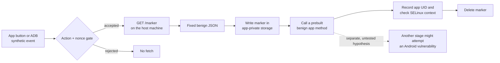
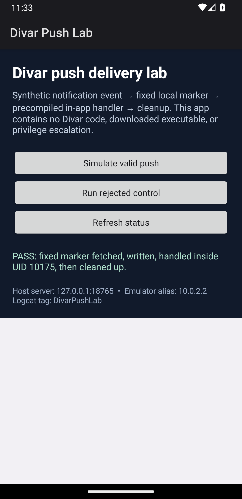

# Push-gated staging: an Android lab

**Hamid Kashfi · October 2026**

This small app shows why a crafted push message can matter even when the app's own data is not the objective. In the Divar APKs I examined, a qualifying notification could hand an encoded address to an inserted worker. The worker could fetch instructions, write supplied bytes, invoke a compatible method, and delete the file later. That makes the installed app a possible route to a selected phone. A second stage could act within the app's existing privileges; crossing Android's sandbox would require a separate vulnerability.

The lab demonstrates the *delivery boundary* with a synthetic app and a fixed, local marker service. It contains no Divar APK, OneSignal credentials, Firebase project, downloaded executable, or privilege escalation code. Its marker is harmless text. It does not show that anyone sent a malicious Divar push or ran a second stage on a real device.

## What runs





*API 33 emulator capture: the synthetic app handled a benign marker inside its ordinary app UID. This is not a historical Divar execution trace.*

The dashed step is a research hypothesis, **not** part of the program. In inspected Divar code, its OneSignal extender and Firebase Messaging service feed the notification handler. This app does not connect to either service. OneSignal is a push platform integrated into the inspected app; the APKs do not show a OneSignal breach or attacker control of its account. Its API can address individual subscriptions, which is why records of who sent what, when, and to whom would matter in an investigation. [OneSignal's API documentation](https://documentation.onesignal.com/reference/create-message) describes that targeting capability; [Firebase documents the Android delivery path](https://firebase.google.com/docs/cloud-messaging/fcm-architecture).

## Run it

You need JDK 21, Android SDK platform 34, an Android emulator, ADB, Python 3, and the Gradle wrapper supplied with this project. **Docker is not needed. Android Studio is optional** if those command-line tools are already installed. An Android 13/API 33 emulator is a convenient test image; the lab is not tied to an old vulnerable image.

On macOS with Android Studio installed, the tested command-line setup is:

```sh
export ANDROID_HOME="$HOME/Library/Android/sdk"
export JAVA_HOME="/Applications/Android Studio.app/Contents/jbr/Contents/Home"
export PATH="$ANDROID_HOME/emulator:$ANDROID_HOME/platform-tools:$PATH"
```

From the repository root, run the marker service in one terminal:

```sh
python3 tools/marker_server.py
```

The service binds only to `127.0.0.1:18765` on your computer and serves only `GET /marker`. The Android emulator uses `10.0.2.2` to reach the host loopback address, as [Android documents](https://developer.android.com/studio/run/emulator-networking-address). The response is always:

```json
{"kind":"lab-marker","nonce":"divar-lab","message":"benign"}
```

In another terminal, start an emulator, then build and install the app:

```sh
emulator -list-avds
emulator @YOUR_AVD_NAME
./gradlew :app:assembleDebug
adb install -r app/build/outputs/apk/debug/app-debug.apk
```

Open **Divar Push Lab** in the emulator. Tap **Simulate valid push**, then **Run rejected control**. **Refresh status** shows the latest state. The accepted path fetches the fixed marker; the rejected control stops before the fetch.

For a repeatable command-line trigger, the lab app exports its own receiver. ADB or another app on the emulator can send this fixed event; the receiver accepts only the lab action and nonce, and no sender can supply a destination or payload. This is a **synthetic notification-shaped event**. It is not a real Firebase/OneSignal push and it does not address Divar's receiver:

```sh
adb shell am broadcast -n org.hamidk.divarpushlab/.LabPushReceiver \
  -a org.hamidk.divarpushlab.SIMULATE_PUSH --es nonce divar-lab
adb shell am broadcast -n org.hamidk.divarpushlab/.LabPushReceiver \
  -a org.hamidk.divarpushlab.SIMULATE_PUSH --es nonce invalid-nonce
adb logcat -d -s DivarPushLab:D '*:S'
```

On the accepted path, the `DivarPushLab` log records the gate, fixed endpoint match, marker receipt, file write, and call to a precompiled method. Its identity line reports `UID` and `SELinux` (or `unavailable` if the label cannot be read), followed by `no external code or native binary executed`. It then reports marker cleanup. The negative event should be rejected without a `/marker` request. For the mock service's own checks:

```sh
python3 -m unittest discover -s tools -p 'test_*.py'
```

**Observed run:** On an API 33 ARM64 emulator, the accepted ADB event matched the fixed endpoint, made one `GET /marker` that returned HTTP 200, wrote the marker, called the precompiled handler, and cleaned up. The handler logged UID `10175` and SELinux context `u:r:untrusted_app:s0:c175,c256,c512,c768`; the app displayed `PASS`. A wrong nonce logged rejection with no additional GET. UID and SELinux categories can differ on another emulator or run. This validates the lab path only.

If the emulator cannot reach the service, check that the Python process is still running and that a host firewall permits the emulator's connection to the host loopback service. On a physical phone, `10.0.2.2` is not a route to your computer; this setup is for an emulator.

## Optional cloud transport

A later demo could feed the same **fixed marker event** through a fresh Firebase or OneSignal test project registered to this synthetic package. Keep the endpoint allowlist and benign response unchanged, and use only lab subscriptions. That would test cloud delivery, not add evidence about historical Divar notifications. It needs separate project setup and sender credentials; none are present here. [Firebase's Android setup guide](https://firebase.google.com/docs/android/setup) and [OneSignal's Android setup guide](https://documentation.onesignal.com/docs/android-sdk-setup) describe the current configuration requirements. Do not reuse Divar's package, signing key, or push credentials.

## Where the real evidence ends

| Evidence | What it supports | What it does not establish |
| --- | --- | --- |
| Preserved Divar APKs, DEX and manifest review | The inserted worker and notification route are present in sampled signed builds. | A push was sent, who controlled its delivery, or a device executed a payload. |
| This lab's emulator log | A notification-shaped input can reach a tightly controlled marker fetch and a benign in-app method. | Historical Divar activity, dynamic code loading, native binary execution, or elevated privileges. |
| A future device trace, if found | It may identify a push, subsequent fetch, downloaded bytes, or process behavior. | Attribution by itself. |

The sampled release picture is uneven: `11.14.9` lacks the known inserted class, `11.14.10` is the first confirmed positive APK, `11.14.15-b` lacks the chain between positive samples, and `11.14.19-b` retains the worker while its inspected sender lacks the relay. The relay returns in `11.14.20-b`; `11.15.0-w` lacks the known class. These are observations of available builds, not a continuous installation history. See [the evidence notes](docs/evidence.md) for hashes, limits, and sources.

The original worker's write-and-invoke behavior also should not be mistaken for a demonstrated Android escape. Android gives each app a UID sandbox, and Android 10 removed direct execution permission for files in the writable app home directory for apps targeting API 29 or later. The lab therefore calls a harmless method already compiled into itself and records its ordinary app identity. [Android sandbox](https://source.android.com/docs/security/app-sandbox) · [Android 10 execution rule](https://developer.android.com/about/versions/10/behavior-changes-10).

## If you investigate a real incident

Preserve the app build and hash, the actual notification fields, server responses, device logs, and any fetched file before drawing conclusions. Divar infrastructure could hold push requests or jobs; OneSignal may have message records if its route was used; FCM delivery exports and phones may add timing and recipient evidence. Retention and field coverage vary, and a hidden push might leave no visible notification. A push record alone cannot prove that the later fetch or invocation occurred. See [the evidence notes](docs/evidence.md) and the [separate LPE evidence worksheet](docs/lpe-evidence-template.md).

## Sources and credit

- [raminfp's Divar code analysis](https://gist.github.com/raminfp/a548a2af86108eb40b8bffc5c8f07aaa)
- [My X post on why this delivery path matters](https://x.com/hkashfi/status/2106147963332633025)
- [Android emulator host networking](https://developer.android.com/studio/run/emulator-networking-address), [app sandbox](https://source.android.com/docs/security/app-sandbox), and [Android 10 execution change](https://developer.android.com/about/versions/10/behavior-changes-10)
- [OneSignal message targeting](https://documentation.onesignal.com/reference/create-message) and [Firebase Messaging architecture](https://firebase.google.com/docs/cloud-messaging/fcm-architecture)

The original Divar APKs and decompiled code are not part of this repository. The lab and accompanying text were prepared with LLM assistance; the Divar summary draws on the cited analysis and sampled APK review. License for this repository's original material: [MIT](LICENSE).
