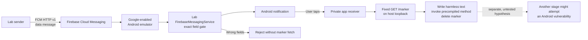

# Cloud push to a synthetic Android app

**Hamid Kashfi · October 2026 · lab version 1.1**

The Divar APKs described in [raminfp's code analysis](https://gist.github.com/raminfp/a548a2af86108eb40b8bffc5c8f07aaa) contain an inserted route from a qualifying push to a worker that can fetch instructions, write supplied bytes, invoke a compatible method, and later delete the file. As I noted in [my X post](https://x.com/hkashfi/status/2106147963332633025), the installed app could therefore be useful as a way to reach selected phones, even if its own data were not the objective. A second stage could act inside the app's privileges; crossing Android's sandbox would require a separate vulnerability.

This repository tests the delivery boundary with **real Firebase Cloud Messaging (FCM) sent to a synthetic app on an Android emulator**. The test message crosses Google's cloud service, reaches the app's `FirebaseMessagingService`, causes the app to post an Android notification, and continues only when the user taps it. The rest is a fixed, harmless marker exercise. The app is not a modified Divar APK or a clone of Divar's notification handler. It does not use OneSignal, fetch executable code, or attempt privilege escalation.

[Watch the 23-second cloud push demo](docs/divar_cloud_push_demo.mp4): the app's accepted-message status, the Android notification shade, a user tap, and `PASS` on the API 33 emulator. The recording begins after the send; it does not show the sender's API request. It is a synthetic app test, not a Divar device trace.

## What the test shows



| Part | Fidelity and limit |
| --- | --- |
| Cloud transport | A real FCM send targets this lab installation by Firebase Installation ID (FID). This exercises cloud registration and delivery on the emulator; it is not a locally injected notification or ADB broadcast. |
| Android interaction | The app itself posts a system notification after checking the data fields. The user taps that notification to begin the fixed marker step. |
| Divar comparison | The inspected Divar builds used their own notification code and included OneSignal and Firebase routes. This app has different code, package, signing identity, field gate, and payload behavior. It is a demonstration of the *kind* of delivery boundary, not a faithful reconstruction of a historical push or proof that one was sent. |
| Further exploitation | The dashed edge is a research hypothesis. No downloaded binary, dynamic code, local privilege escalation, or sandbox escape is in this lab. |

The tap requirement is a choice in this lab. It should not be read back into the Divar implementation; this test does not determine whether a historical qualifying message needed a user tap.

OneSignal is a push platform present in the inspected Divar app. It can [target subscriptions](https://documentation.onesignal.com/reference/create-message), so retained sender, recipient, and message records could matter in a real investigation. This lab sends **directly through FCM**; it does not test a OneSignal account or establish that anyone controlled Divar's push infrastructure.

## Run the cloud test

You need JDK 21, Android SDK platform 34, an emulator image with Google Play services, ADB, Python 3, Google Cloud CLI (`gcloud`) for the included sender, and the Gradle wrapper. Android Studio can provide the SDK and emulator; Docker is not needed. The tested device was an API 33 ARM64 emulator. The app targets API 34.

On macOS with Android Studio installed, the command-line setup is:

```sh
export ANDROID_HOME="$HOME/Library/Android/sdk"
export JAVA_HOME="/Applications/Android Studio.app/Contents/jbr/Contents/Home"
export PATH="$ANDROID_HOME/emulator:$ANDROID_HOME/platform-tools:$PATH"
```

1. Create a fresh [Firebase project and Android app](https://firebase.google.com/docs/android/setup) for the package **`org.hamidk.divarpushlab`**. Enable the Firebase Cloud Messaging API in that project. Download its `google-services.json` into `app/google-services.json`. This file is ignored by Git. Do not use Divar's package, signing key, or push credentials.
2. Start the fixed marker service in one terminal: `python3 tools/marker_server.py`. It serves only `GET /marker` on host `127.0.0.1:18765` and always returns `{"kind":"lab-marker","nonce":"divar-lab","message":"benign"}`. The emulator reaches host loopback through `10.0.2.2`, as [Android documents](https://developer.android.com/studio/run/emulator-networking-address).
3. Start a Google-enabled emulator, build, install, and open the app:

   ```sh
   emulator -list-avds
   emulator @YOUR_AVD_NAME
   ./gradlew :app:assembleDebug
   adb install -r app/build/outputs/apk/debug/app-debug.apk
   ```

4. In **Divar Push Lab**, allow Android notifications and wait for FCM registration. The screen shows only the last four characters of this installation's Firebase Installation ID (FID). The included sender reads the current FID privately through ADB on the emulator; **Copy registered FID** is available if you send the HTTP request manually. Keep the full FID out of screenshots, public logs, and commits. FIDs can change. [Firebase's Android guide](https://firebase.google.com/docs/cloud-messaging/android/get-started#access-the-firebase-installation-id) explains the registration flow.
5. Authenticate `gcloud` with a sender account that has `cloudmessaging.messages.create` permission in *your* project, then send the fixed accepted sample:

   ```sh
   gcloud auth login
   python3 tools/send_cloud_sample.py --project YOUR_FIREBASE_PROJECT_ID accepted
   ```

   The helper reads the FID from this debug app with `adb run-as`, gets a short-lived token from `gcloud`, and sends a fixed data-only HTTP v1 message. It prints the API's **acceptance for delivery**, which is not proof that the emulator received it. The [sample message bodies and field breakdown](docs/sample-events.md) show exactly what it sends. [Firebase's HTTP v1 guide](https://firebase.google.com/docs/cloud-messaging/send/v1-api) explains authorization. Never put a service-account key or access token in this repository.
6. Open the emulator's notification shade and tap **Cloud lab message received**. The tap, rather than FCM receipt alone, starts the marker fetch. Return to the app and use **Refresh lab status** to see `PASS`. Check `adb logcat -d -s DivarPushLab:I '*:S'` and the marker server terminal for the corresponding `GET /marker`. The [sample events](docs/sample-events.md) also show rejected FCM messages.

To check the rejection gate, send `python3 tools/send_cloud_sample.py --project YOUR_FIREBASE_PROJECT_ID rejected`. It changes only the fixed nonce. The expected result is a rejection log with no new lab notification or marker request. For an API schema check without delivery, add `--validate-only` before `accepted` or `rejected`.

The exact gate accepts only a **data-only** message with `lab_action=deliver_marker` and `lab_nonce=divar-lab`. There is no top-level FCM `notification` object: in a background app, FCM can display such a notification without calling the app's `onMessageReceived` handler. Here the app must receive and validate the data first, then post the Android notification itself. [Firebase documents that distinction](https://firebase.google.com/docs/cloud-messaging/android/receive-messages).

The marker endpoint is compiled into the app as an encoded constant and must decode to the allowlisted emulator URL. Neither the push nor the server can choose a URL, file, method, or executable. The response is checked against an exact three-field schema. The app writes harmless text in its private storage, calls a method compiled into the app, logs its ordinary UID and SELinux label, and deletes the text file. On a physical phone, `10.0.2.2` is not a route to the host; this marker setup is emulator-specific.

**Observed on 4 October 2026:** An FCM HTTP v1 message reached the API 33 emulator; the lab service accepted its data fields and posted an Android notification. Tapping it triggered the fixed marker GET, in-app write, precompiled handler, cleanup, and `PASS` log. This establishes that the lab's cloud-to-tap-to-marker path worked on that emulator. It does not establish anything about historical Divar delivery, fetched malware, or elevated privileges.

The public checkout builds without `google-services.json`, but cloud registration and reception require your own Firebase configuration. You can separately check the marker server with `python3 -m unittest discover -s tools -p 'test_*.py'`.

## Where the real evidence ends

| Evidence | What it supports | What it does not establish |
| --- | --- | --- |
| Preserved Divar APKs, DEX, and manifest review | The inserted worker and notification route are present in sampled signed builds. | A qualifying push was sent, who controlled delivery, or a device executed a payload. |
| This synthetic FCM emulator test | Real cloud delivery can reach an installed app, produce a notification, and continue after a tap to a fixed benign in-app action. | OneSignal or Divar parity, dynamic code loading, native binary execution, or elevated privileges. |
| A future historical device or provider trace | It may identify a push, fetch, downloaded bytes, or process behavior. | Attribution by itself. |

The sampled release picture is uneven: `11.14.9` lacks the known inserted class; `11.14.10` is the first confirmed positive APK; `11.14.15-b` lacks the chain between positive samples; `11.14.19-b` retains the worker while its inspected sender lacks the relay; the relay returns in `11.14.20-b`; and `11.15.0-w` lacks the known class. These are observations of available builds, not a continuous installation history. See the [evidence notes](docs/evidence.md) for hashes and limits.

The original worker's write-and-invoke behavior should not be mistaken for a demonstrated Android escape. Android gives each app a UID sandbox, and Android 10 removed direct execution permission for files in the writable app home directory for apps targeting API 29 or later. This lab calls a harmless method already compiled into itself and records its ordinary app identity. [Android sandbox](https://source.android.com/docs/security/app-sandbox) · [Android 10 execution rule](https://developer.android.com/about/versions/10/behavior-changes-10).

For a real incident, preserve the app build and hash, notification fields, sender jobs, server responses, device logs, and any fetched file before drawing conclusions. Divar infrastructure, OneSignal, FCM, and affected phones may each hold different portions of that trail; retention and field coverage need to be checked. A push record alone cannot prove a later fetch or execution. See the [evidence notes](docs/evidence.md) and [LPE evidence worksheet](docs/lpe-evidence-template.md).

## Sources and credit

- [raminfp's Divar code analysis](https://gist.github.com/raminfp/a548a2af86108eb40b8bffc5c8f07aaa)
- [My X post on why this delivery path matters](https://x.com/hkashfi/status/2106147963332633025)
- [Firebase Android registration](https://firebase.google.com/docs/cloud-messaging/android/get-started), [receiving messages](https://firebase.google.com/docs/cloud-messaging/android/receive-messages), and [FCM HTTP v1 sends](https://firebase.google.com/docs/cloud-messaging/send/v1-api)
- [Android emulator host networking](https://developer.android.com/studio/run/emulator-networking-address), [app sandbox](https://source.android.com/docs/security/app-sandbox), and [Android 10 execution change](https://developer.android.com/about/versions/10/behavior-changes-10)
- [OneSignal message targeting](https://documentation.onesignal.com/reference/create-message)

The original Divar APKs and decompiled code are not part of this repository. The lab and accompanying text were prepared with LLM assistance; the Divar summary draws on the cited analysis and sampled APK review. License for this repository's original material: [MIT](LICENSE).
